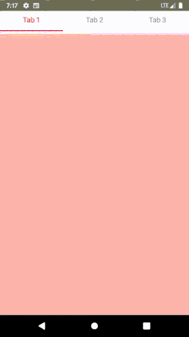

    
    
    

# react-native-tabbed-bar
React Native Tab Bar Library

### Installation and Usage

Please check this blog for installation and usage [this link](https://www.logisticinfotech.com/blog/react-native-tabbed-bar-library/)

### Basic Properties

| Prop | Default | Type | Description |
| ---- | ------- | ---- | ----------- |

| displayTab          | 3                       | `Number`                               | Number of tabs show in line.                                      |
| children               | ---                       | `Node`                               | List of children node for the tabs. its required.                                               |
| tabBarContainerStyle | {}                       | `style`                              | Style of the one tab bar.                                               |
| tabBarTextStyle      | {}                       | `style`                              | Style of the tab bar text.                                               |
| tabIndicatorStyle            | {}                       | `style`                              | Style of the tab indicator.                                              |
| activeColor                | red                         | `string`                             | Active color of tab bar text and tab indicator.                                              |
| inactiveColor              | grey                        | `string`                             | Inactive color of tab bar text and tab indicator.                                             |
